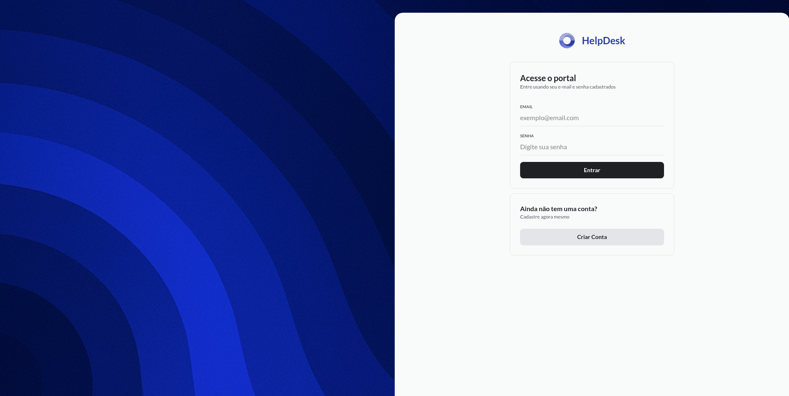
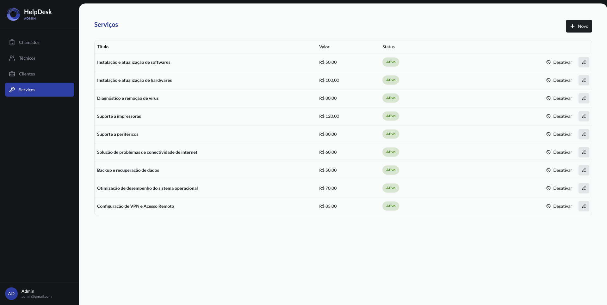
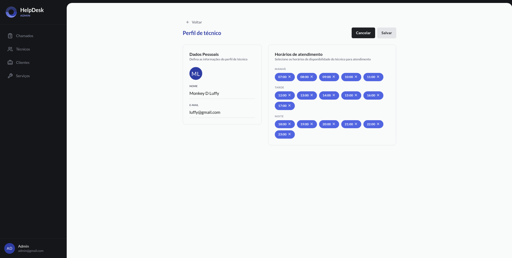
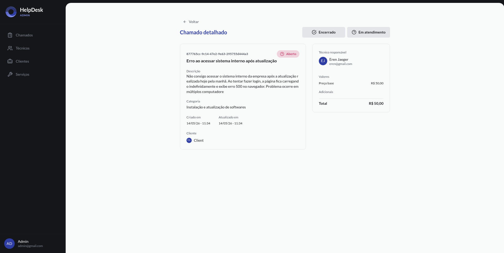
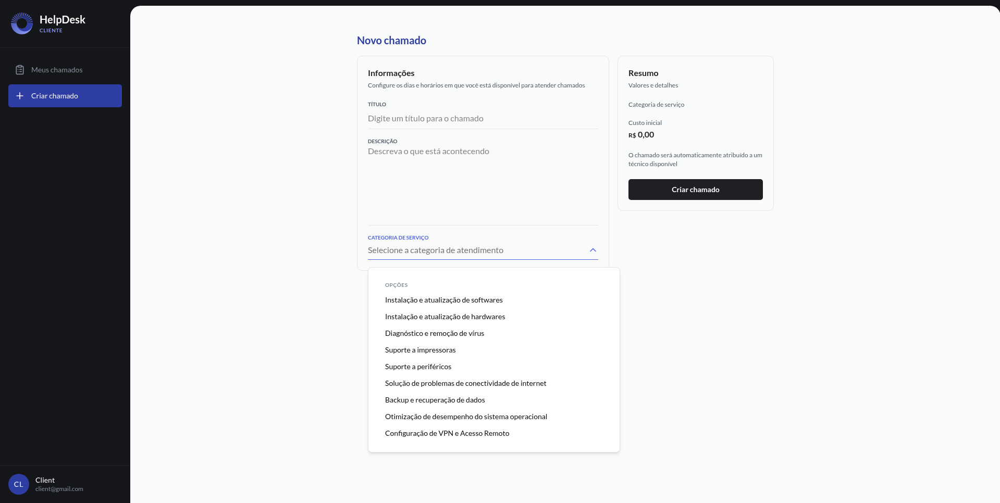
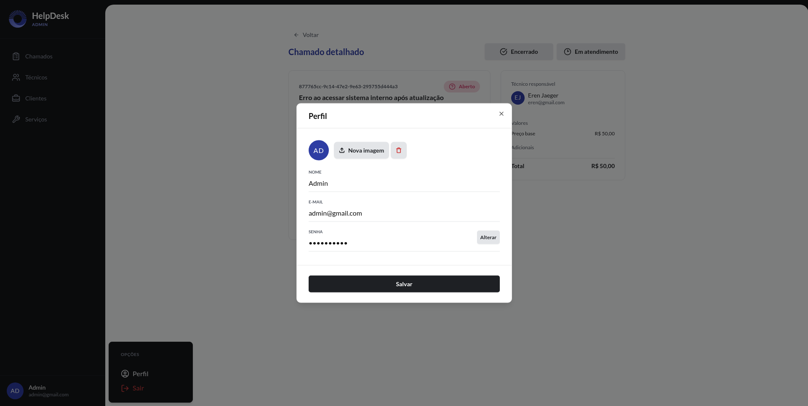
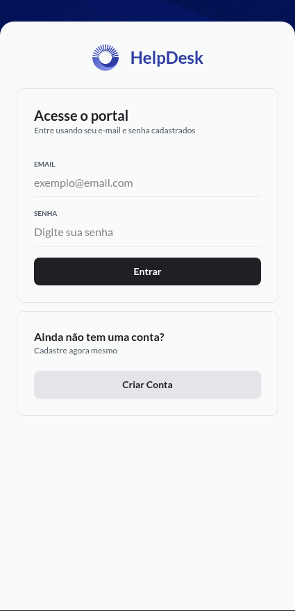
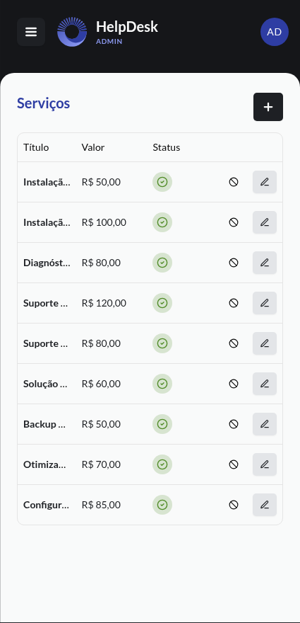
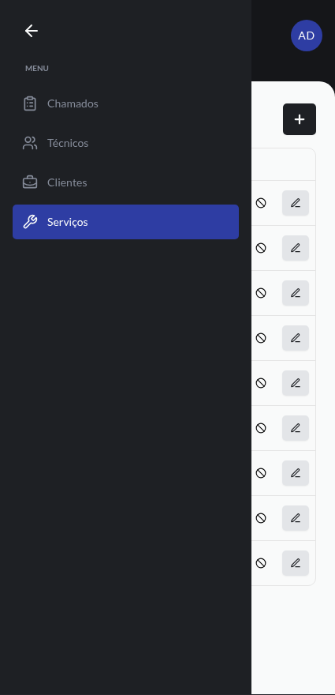

# HelpDesk Frontend

Frontend de uma aplicação de gerenciamento de chamados de suporte de T.I. desenvolvido com **Next.js**, focado em organização, gerenciamento e acompanhamento de tickets de suporte técnico.

---

# 📋 Sobre o projeto

O **HelpDesk Frontend** é a interface web da aplicação HelpDesk, responsável por permitir que usuários e técnicos possam:

* Criar chamados de suporte
* Acompanhar status dos chamados
* Atualizar informações de atendimento
* Gerenciar horários de atendimento dos técnicos
* Fazer upload de imagem de perfil
* Autenticar usuários
* Administrar atendimentos de forma prática e intuitiva

A aplicação foi construída utilizando tecnologias modernas do ecossistema React e Next.js.

---

## Deploy

[https://help-desk-frontend-seven.vercel.app/](https://help-desk-frontend-seven.vercel.app/)

---

## Backend
API REST da aplicação HelpDesk:

https://github.com/ramonvbn/help-desk-backend

---

## 📸 Screenshots

### Login



### Serviços



### Perfil de técnico



### Chamado detalhado



### Novo chamado




### Perfil de usuário




### Mobile



---



---



---

# 🚀 Tecnologias utilizadas

## Frontend

* [Next.js](https://nextjs.org/)
* [React](https://react.dev/)
* [TypeScript](https://www.typescriptlang.org/)
* [TailwindCSS](https://tailwindcss.com/)
* [Radix UI](https://www.radix-ui.com/)
* [ShadcnUi](https://ui.shadcn.com/)
* [React Hook Form](https://react-hook-form.com/)
* [Zod](https://zod.dev/)
* [TanStack Query](https://tanstack.com/query)
* [Axios](https://axios-http.com/)
* [date-fns](https://date-fns.org/)

## Testes

* [Vitest](https://vitest.dev/)
* [Testing Library](https://testing-library.com/)
* [Playwright](https://playwright.dev/)
  
---

# 📁 Estrutura do projeto

```bash
src/
 ├── app/                # Rotas e páginas da aplicação
 ├── components/         # Componentes reutilizáveis
 ├── libs/               # Configurações de bibliotecas
 ├── api/                # Configurações, tipagens e chamadas de API e serviços
 ├── utils/              # Funções utilitárias
 └── tests/              # Testes da aplicação
```

---

# ⚙️ Funcionalidades

## 🔐 Autenticação

* Login de usuários
* Persistência de autenticação
* Controle de acesso
* Uso de JWT

## 📞 Chamados

* Criação de chamados
* Atualização de status
* Visualização detalhada

## 👨‍🔧 Técnicos

* Gerenciamento de disponibilidade
* Controle de horários de atendimento
* Associação de chamados

## 🖼️ Uploads

* Upload de imagem de perfil
* Validação de tamanho e tipo de arquivo

## 🌙 Interface

* UI responsiva
* Componentes acessíveis com Radix UI

---

# 🎨 Padrões utilizados

* Componentização
* Responsividade
* Tipagem forte com TypeScript
* Validação com Zod
* Gerenciamento de estado servidor com React Query
* Formulários com React Hook Form

---

# 👨‍💻 Autor

Desenvolvido por Ramon Victor Barros Nunes.

* GitHub: [https://github.com/RamonVBN](https://github.com/RamonVBN)
* LinkedIn: [https://linkedin.com/in/ramon-barros-4a107837a](https://linkedin.com/in/ramon-barros-4a107837a)
